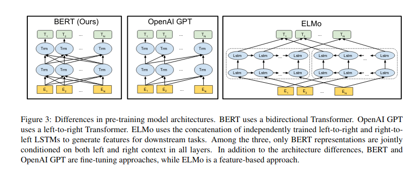

## Linguistic Knowledge and Transferibility for Contextual Representation
Liu et al 2019
[Code provided by authors](https://github.com/nelson-liu/contextual-repr-analysis)

**Finding**: Frozen contextual represenations + linear models perform similar to fine tuning model weigths on specific tasks

**Arc prediction**: binary classification task, where the model is trained to identify whether a relation exists between two tokens.

e.g. given a word pair w1,w2,
we input [w1 , w2 , w1 dot w2 ] into the probing model

**Negative examples**: To generate negative examples we take each positive example (w a , w b ), where w b occurs after w a and the two tokens share a coreference cluster. We create a negative example (w random entity , w b ), where w random entity is a token that occurs before w b and belongs to a different coreference cluster.

------

## Bert for Coreference Resolution
Joshi et al 2019
[Code provided by authors](https://github.com/mandarjoshi90/coref)

-----

## What do we learn from context? Probing for sentence structure in contextualized word represenattions 

Tenney et al 2019

-----

## The Illustrated Transformer (blog post)

Jay Allamar: [Blogpost](http://jalammar.github.io/illustrated-transformer/)

1. Stack of encoders, same size stack of decoders. In Bert base: 12 encoder layers, in bert large: 24.

2. Simplified verison with 2:

3. Multi-headed self-attention: 
    - useful if we’re translating a sentence like “The animal didn’t cross the street because it was too tired”. Which word “it” refers to.

4. Each layer applies self-attention, and passes its results through a feed-forward network, and then hands it off to the next encoder.

-----

## The Illustrated BERT
Jay Allamar: [Blogpost](http://jalammar.github.io/illustrated-bert/)

1. W0rd Embeddings (word2vec) VS contextualised word-embeddings (ELMo, BERT)
Word embeddings use fixed embedding for each word. 
ELMo looks at the entire sentence before assigning each word in it an embedding. So embeddings are not fixed. 

2. ELMo/BERT

- ELMo uses bi-directional LSTMs. 
- The OpenAI Transformer (GPT) is made up of the decoder stack from the Transformer. No encoder-decoder attention, only self-attention. ELMo’s language model was bi-directional, but the openAI transformer only trains a forward language model. 
- BERT user bi-directional transformer (also referred to as "Transformer encoder"). Its language model looks both forward and backwards (“is conditioned on both left and right context”).   
- Bert is pre-trained on 2 tasks:  
    - 1. language modeling task masks 15% of words in the input and asks the model to predict the missing word.   
    - 2. Bert's 2. task is pre-trained on is a two-sentence classification task: can sentence A follow sent B?  
- BERT doesn’t look at words as tokens. Rather, it looks at WordPieces.

Transformers deal with long-term dependancies better than LSTMs.

- btw, Bidirectional Encoder Representations  from Transformers

